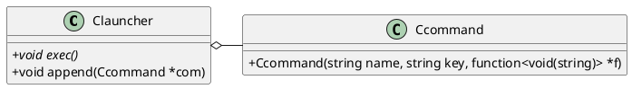
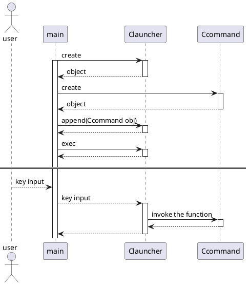

# prompt

## sample image
```
======================================
quit : q
sample : t
======================================
```
"quit", "sample" ... name of user commands  
"q", "t" ... key input to invoke the command

## sample code
Please see "main.cpp".

## How to use "prompt"?

1. create the function like "void function(string arg);"
2. create the object of Clauncher.
3. Clauncher::append() such as below:
```
launcher.append(new Ccommand{"sample", "t",
                               new function<void(string)>{template_function}});
```
"sample" -> name of user command.  
"t" -> key input to invoke the command.

4. invoke Clauncher::exec().

## Class diagram


## Sequence diagram

